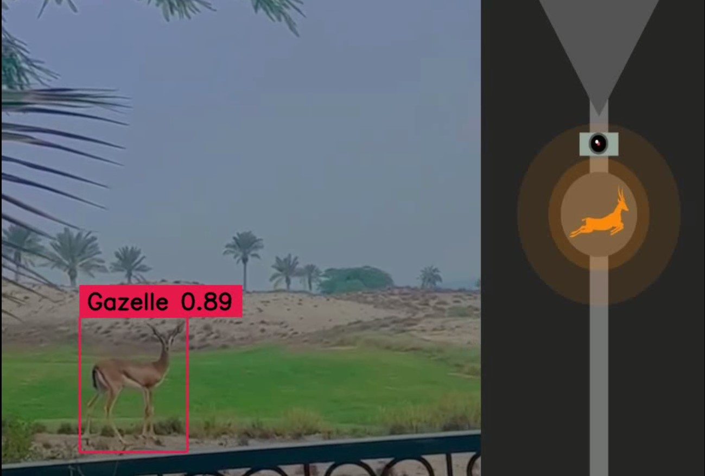

# Deer-Detection-System-with-Raspberry-Pi-for-Smart-Traffic-Signal-Control

## Installation Guide

Follow these steps to set up the environment and run the project.

### 1. Install Miniconda (Windows)
1. Download Miniconda from [Miniconda Official Site](https://docs.conda.io/en/latest/miniconda.html).
2. Install Miniconda following the on-screen instructions.
3. Open the Command Prompt and navigate to the directory where you downloaded this repository.

### 2. Clone the Repository
```bash  
git clone https://github.com/Arsalantahir66/Deer-Detection-System-with-Raspberry-Pi-for-Smart-Traffic-Signal-Control.git
cd Deer-Detection-System-with-Raspberry-Pi-for-Smart-Traffic-Signal-Control
  
```
### 3. Setup Conda Environment
```bash  
conda create -n myenv python=3.10 -y
conda activate myenv
  
```
### 4. Install Dependencies
```bash  
pip install numpy==1.23.1
pip install ultralytics
pip install supervision==0.2.0
```
### 5. Run Camera Detection
```bash  
python camera.py
```
